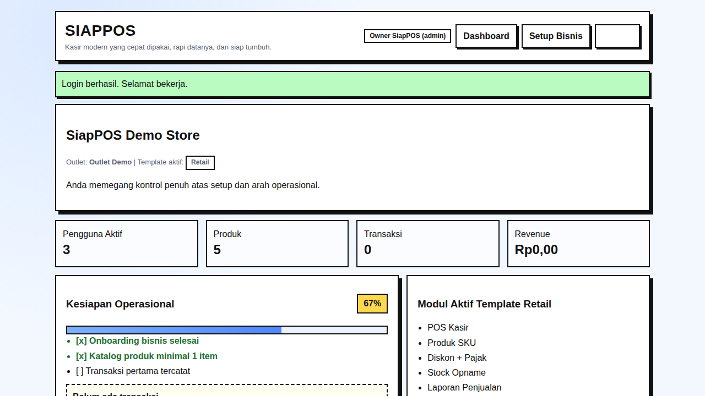
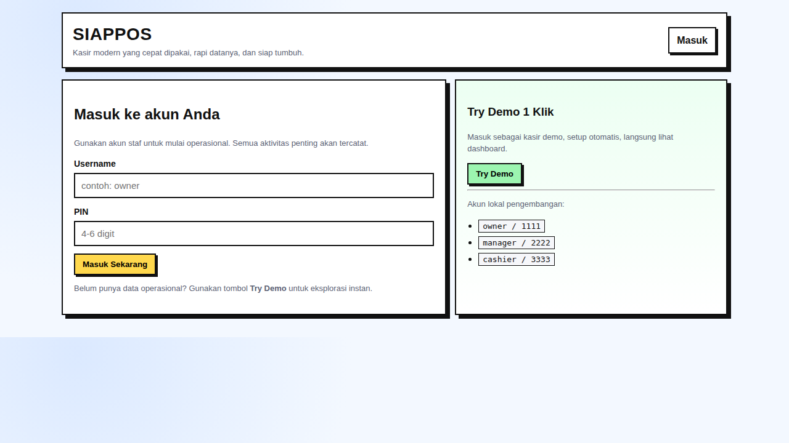
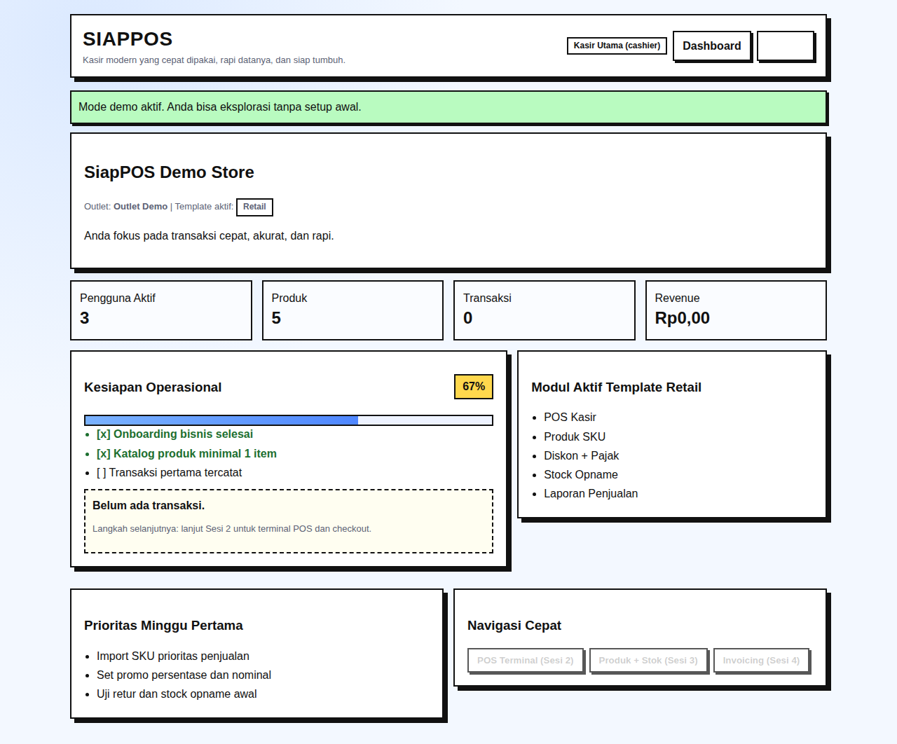

# SiapPOS 🛒



SiapPOS adalah sistem Point of Sale (POS) modern yang dirancang untuk menjadi andalan dalam operasional bisnis. Cepat dipakai, rapi datanya, dan siap tumbuh. Berfokus pada kemudahan akses (usability) untuk pengguna lapangan (kasir, manager) namun tetap memiliki fondasi teknis yang kuat untuk skala menengah.

## ✨ Fitur Utama

- **Role-Based Access Control (RBAC):** Memisahkan akses antara `admin` (Owner), `manager`, dan `cashier`.
- **Onboarding Cerdas & Cepat:** Setup bisnis awal sangat mudah menggunakan checklist *go-live* interaktif.
- **Dukungan Berbagai Template Bisnis:** Dilengkapi dengan konfigurasi default untuk berbagai jenis bisnis:
  - F&B (Food and Beverage)
  - Service (Jasa)
  - Retail (Toko Ritel)
  - Kelontong / Bangunan
- **Dashboard Ringkas:** Menampilkan metrik utama (KPI) harian, tingkat kesiapan operasional, dan notifikasi penting.
- **Keamanan Lapis Dasar:**
  - Perlindungan *Cross-Site Request Forgery (CSRF)*.
  - Implementasi *Security Headers* (X-Frame-Options, X-Content-Type-Options, dll).
  - Regenerasi Session ID untuk menghindari session fixation.
  - Numeric guard PIN yang mencegah input di luar batas.

## 🛠 Arsitektur & Teknologi

Sistem ini tidak menggunakan framework full-stack besar yang berat, melainkan ditulis menggunakan **Vanilla PHP (PHP 8+)** yang diarsiteki dengan prinsip pengembangan modern untuk memastikan kodenya maintainable dan testable:

1. **Clean Architecture (DDD - Domain Driven Design):**
   - Aplikasi dipecah ke dalam berbagai domain (`Auth`, `Order`, `Product`, `Settings`).
   - Kode dipisahkan dari logika bisnis inti (*Domain*) dan cara penyajiannya (*App / UI / HTTP*).
2. **Repository Pattern:**
   - Semua akses database diabstraksi menggunakan *Repository*, sehingga memudahkan unit-testing atau migrasi database ke depan.
   - Saat ini menggunakan **SQLite** (`siappos.sqlite`) untuk portabilitas maksimum dan zero-configuration deployment.
3. **Event Bus (Pub/Sub Pattern):**
   - Komunikasi antar domain ditangani melalui sebuah *Event Bus* terpusat (contoh: *OrderCheckedOut* bisa ditangkap domain inventori).
4. **Data Transfer Objects (DTO):**
   - Transmisi data antar layer menggunakan DTO yang strongly-typed untuk mengurangi error saat runtime.

---

## 📸 Antarmuka (Screenshots)

### Halaman Login


### Halaman Dashboard


### Dashboard Demo Lengkap


---

## 🚀 Cara Menjalankan

SiapPOS dirancang agar bisa dijalankan di mana saja dengan mudah, tanpa konfigurasi kompleks (zero-config). Cukup PHP dan ekstensi SQLite bawaan.

1. Clone repositori ini ke lokal Anda.
2. Navigasi ke dalam folder proyek.
3. Jalankan development server bawaan PHP:

```bash
php -S 127.0.0.1:8088 -t public
```

4. Buka di browser Anda: `http://127.0.0.1:8088/?page=login`

### 🔑 Akun Demo / Development
Anda dapat masuk menggunakan konfigurasi default berikut:
- **Owner / Admin:** `owner` | PIN: `1111`
- **Manager:** `manager` | PIN: `2222`
- **Cashier:** `cashier` | PIN: `3333`

Atau Anda dapat menggunakan tombol **"Try Demo 1 Klik"** di halaman login untuk *fast-track* masuk ke sistem sebagai demo user.
